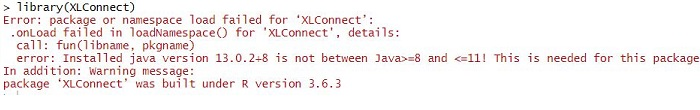

```{r setup, include=FALSE}
knitr::opts_chunk$set(echo = TRUE)
```

## XLconnect R Package

**XLConnect** is a package that allows for **reading, writing and manipulating Microsoft Excel files** from within R. 

* Advantages:
  + A platform-independent interface to Excel
  + It uses the Apache POI API1 as the underlying interface.
  + XLConnect allows you to produce formatted Excel{textcolor red} reports, including graphics, straight from within R.
  + This enables automation of manual formatting and reporting processes. 
  + Reading and writing named ranges enables you to process complex inputs and outputs in an efficient way


\hfill\break
#### Check my System Info
 
\hfill\break


```{r}
Sys.info()
```


\hfill\break
Install the package in R studio


\hfill\break

```{r eval=FALSE}
install.packages("XLconnect")
library(XLconnect)
```


\hfill\break
Initially I had Java version 13, which is not compatible so i a was getting this error (Figure 1)

\hfill\break


```{r out.width='70%', fig.align='center', fig.cap='Error: Wrong Java Version Installed'}

```


\hfill\break

#### Check your R Version


\hfill\break


**R version**


\hfill\break
```{r}
version
```
* "mingw-w32" or "mingw-w64"

  + "mingw-w64" generate 64bit binaries that will run on windows natively (64bit windows required)
  + "mingw-w32" generate 32bit binaries that will run on windows natively


\hfill\break


You can upgrade your R from Rstudio, if required

```{r eval=FALSE}
install.packages("installr")
library(installr)
updateR()
```


\hfill\break
#### Check Your Java Version

\hfill\break


A 64-bit program will see the information on 64-bit Java, and a 32-bit program will see information on 32-bit Java.

So make sure that you have Java SDK installed is of the same 64 or 32 bit as you R-program.

ON windows command line enter command java -version and it will tell you what you got for Java


\hfill\break


```{r out.width='70%', fig.align='center', fig.cap='Error: Wrong Java Version Installed'}

```


If you require to install JAVA, [Go Here!](https://www.oracle.com/java/technologies/javase-jdk8-downloads.html)


\hfill\break
#### JAVA_HOME env Variable is set right
\hfill\break
After java is installed, make sure that the environment variable **JAVA_HOME** is set right
Check by entering following command


\hfill\break
```{r}
Sys.getenv("JAVA_HOME")
```


\hfill\break
Make sure the variable value is set right by browsing to it  
and if its value is not set
Set it by entering following command


\hfill\break
```{r eval=FALSE}
Sys.setenv(JAVA_HOME = "C:\\Program Files\\Java\\jdkx.x.x_xxx")

```


\hfill\break

You are good to go If \hfill\break
+ R and Java are both 32 bit or 64 bit \hfill\break
+ Java version is between 8 and 11 \hfill\break
+ JAVA_HOME Environment Variable is set right \hfill\break


